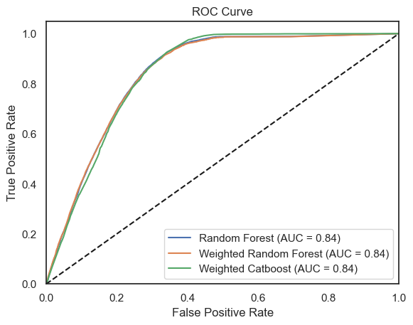
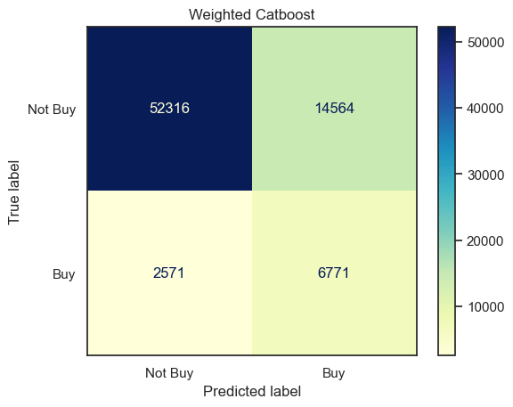

# Insurance Cross-Selling
This project aims to predict customer interest in vehicle insurance based on features such as age, gender, vehicle damage, and others.  
The results could then be used by the Sales Team to approach customers that higher probability of being interested in a vehicle insurance.  
The project involves data analysis, feature engineering, and model training.

## Data Source
The data comes an anonymized insurance company and represents customer data from the previous year before making this available.   
The data can be found on [Kaggle](https://www.kaggle.com/datasets/anmolkumar/health-insurance-cross-sell-prediction).

## Limitations
* Imbalanced data: The are significantly more non-interested customers than interested ones. The imbalance ratio is of about 7, meaning ...   
that there are 7 times as many instances in the majority class as there are in the minority class.
* Lack of customer diversity: All customers have not been with the company for more than 1 year. 
That saying, their level of loyalty is probably not high enough to even think of cross-selling a new insurance type.

## Requirements
Make sure you have the following packages installed:
* numpy and pandas - for reading and manipulations
* seaborn and matplotlib - for plotting
* catboost - for modeling with Catboost
* scikit-learn - for modeling with Random Forest and evaluating the fit and the predictions

## Methodology
Here, I applied 3 models: Random Forest Classifier, Weighted Random Forest Classifier, Weighted CatBoost Classifier.  
* Catboost was included due to its speed and efficiency. 
* Since the data is heavily imbalanced, I weighted it in two instances, for Random Forest and Catboost.
* For the weights, I chose a imbalance of 3 for Catboost and the original one of 7 for Random Forest. A higher value would have led to too many False Positives.

## Conclusions
**1. The AUC was high, getting to 0.84 across all models.**

**2. The Weighted Catboost Classifier performed the best in terms of F1, but not by far from the weighted Random Forest.**

See here the classification reports: 

... for Random Forest:

              precision    recall  f1-score   support

           0       0.88      0.99      0.93     66880
           1       0.37      0.03      0.05      9342

    accuracy                           0.88     76222

============================================================  
... for Weighted Random Forest:

              precision    recall  f1-score   support

           0       0.98      0.69      0.81     66880
           1       0.28      0.89      0.43      9342

    accuracy                           0.71     76222

============================================================  
... for Weighted Catboost:

              precision    recall  f1-score   support

           0       0.95      0.78      0.86     66880
           1       0.32      0.72      0.44      9342

    accuracy                           0.78     76222

============================================================  

**3. As mentioned, still a high number of FPs ...**

Note, due to the imbalanced data, the model is not confident in its evaluation, with the prediction thresholds not going over 0.6.

## Future Considerations
In my opinion, the predictions are premature. Many customers haven't been with the client for a sufficient duration to establish loyalty.  
It would be more sensible to make predictions after amassing customers for a minimum of two years.

